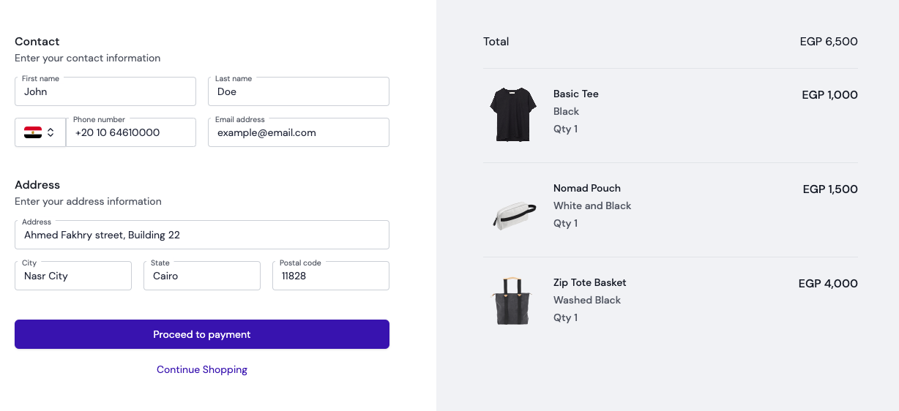
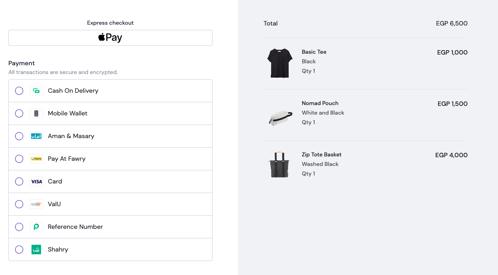

# MoneyHash JavaScript SDK integration guide

## Installing

```shell
npm install @moneyhash/js-sdk
```

## Collecting User Info



This step has nothing to do with moneyHash checkout integration

Personal information & Shipping address is collected by the merchant and sent to MoneyHash (<small><span style="color: rgb(229, 231, 235);">this is optional and not blocker to create a payment intent</span></small>)

## Creating a Payment Intent

After collection all info required for the payment, You can call your backend server to create a payment intent with your account API Key [Payment Intent V1.1](https://docs.moneyhash.io/reference/payment-intent-v11) (<small><span style="color: rgb(229, 231, 235);">all required and customization options mentioned in the docs</span></small>)

```js
const intent = await createIntent({
  amount: totalPrice,
  currency,
  billing_data: {
    first_name: data.first_name,
    last_name: data.last_name,
    email: data.email,
    phone_number: data.phone_number,
  },
  shipping_data: {
    address: data.address,
    city: data.city,
    state: data.state,
    postal_code: data.postal_code,
    first_name: data.first_name,
    last_name: data.last_name,
    phone_number: data.phone_number,
  },
  product_items: cart.map(product => ({
    name: product.name,
    description: product.description,
    quantity: product.quantity,
    amount: product.price[currency],
  })),
  hide_amount_sidebar: true, // UI customization
  hide_navigation_to_payment_methods: true, // UI customization
  successful_redirect_url: `https://shop.moneyhash.io/checkout/order`,
  failed_redirect_url: `https://shop.moneyhash.io/checkout/order`,
  pending_external_action_redirect_url: `https://shop.moneyhash.io/checkout/order`,
  back_url: `https://shop.moneyhash.io/checkout/order`,
});
```

## Checkout

After successfully creating a payment intent, you can use the payment intent ID & [MoneyHash JavaScript SDK constructor](https://docs.moneyhash.io/docs/javascript-sdk) to get details about the intent & available payment methods

1. Create moneyHash sdk instance in your application

   ```js
   import MoneyHash from '@moneyhash/js-sdk/headless';
   const moneyHash = new MoneyHash({
     type: 'payment',
     styles: {
       // customize the checkout UI
       input: {
         focus: {
           borderColor: '#1A82C3',
           boxShadow: '0 0 0 1px #1A82C378',
         },
       },
       submitButton: {
         base: {
           background: '#1A82C3',
           color: '#fff',
         },
         hover: {
           background: '#15699e',
         },
         focus: {
           background: '#15699e',
         },
       },
       loader: {
         backgroundColor: 'white',
         color: '#1A82C3',
       },
     },
   });
   ```

2. Get intent payment methods

   ```js
   const { paymentMethods } = await moneyHash.getIntentMethods(intentId);
   ```

3. Render your custom UI for the payment methods

   

4. Selecting a payment method using moneyHash sdk

   ```js
   await moneyHash.proceedWith({
     type: 'method',
     id: methodId,
     intentId,
   });
   ```

5. At this point, based on your method selection, you can either render the MoneyHash embed to handle the payment, or to render the custom card fields if you selected `CARD` method to proceed with.

- Use MoneyHash SDK to render the checkout as part of the application with

  ```js
  moneyHash.renderForm({ selector: '<css-selector>', intentId });
  ```

  > Note: Make sure dom node with <css-selector> is rendered in the dom before calling this method

- Use custom card elements to collect card information from the user. A detailed explanation of how to do this can be found in the [docs](https://docs.moneyhash.io/docs/javascript-sdk#form-fields).

  

## Event Listeners

To stay up to date with the process, you can use the onComplete and/or onFail callback methods when creating the MoneyHash instance.

```js
const moneyHash = new MoneyHash({
  onComplete: ({ intent, transaction, selectedMethod, redirect, state }) => {
    // redirect to /checkout/order
    console.log('onComplete', {
      intent,
      transaction,
      selectedMethod,
      redirect,
      state,
    });
  },
  onFail: ({ intent, transaction, selectedMethod, redirect, state }) => {
    // redirect to /checkout/order
    console.log('onFail', {
      intent,
      transaction,
      selectedMethod,
      redirect,
      state,
    });
  },
});
```
